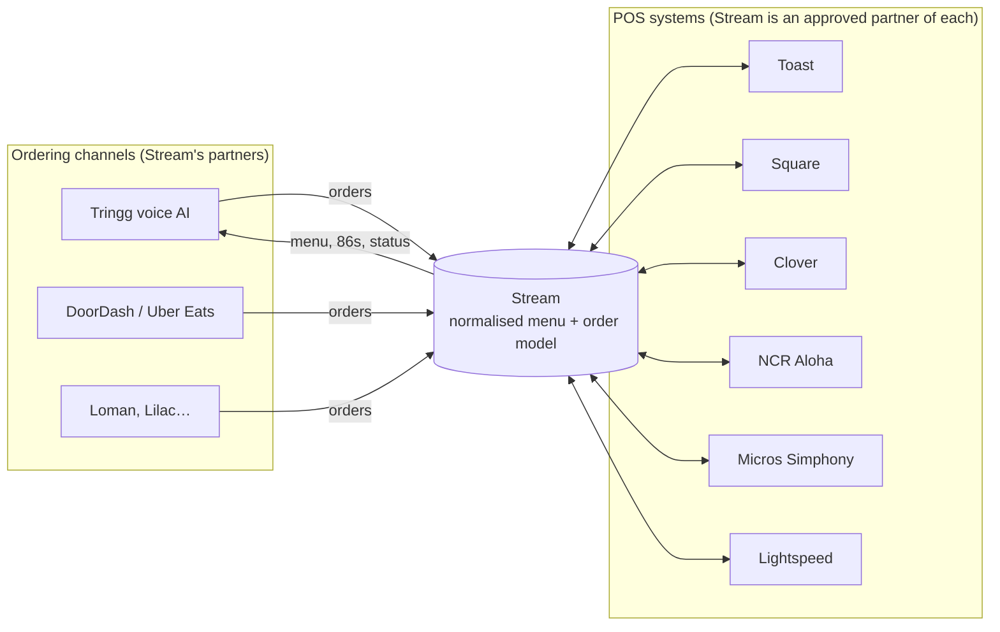
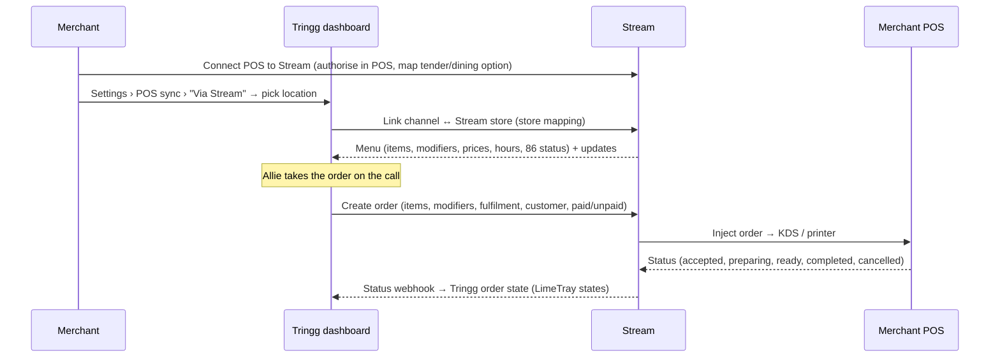

# Stream (streamorders.com) as Tringg's multi-POS layer

_Prepared 2026-09-28, before the Stream demo._

## Sources and limits

- **What was read:** Stream's site, help centre and blog, the Toast and Square marketplace listings, and partner posts. All of it came through search-engine snippets, because this environment's network policy blocks the pages themselves.
- **What wasn't:** Stream's partner API reference is not public. Endpoint names, auth and payloads below are what to **confirm in the demo**, not facts.

---

## 1. What Stream is

Stream is **middleware that sits between restaurant POS systems and ordering channels**. The channels are delivery apps (DoorDash, Uber Eats, Grubhub, Wolt), online ordering, Google ordering, and now **AI ordering**, where it lists Loman and Lilac as partners.

- **For restaurants:** one menu, published to every channel, with every channel's orders dropping into the POS. No extra tablets and no re-keying.
- **For partners such as Tringg:** *"With one build into Stream, partners can access a broader integration ecosystem, embed the experience into their own product, and let Stream handle the maintenance."* Stream also sells this **white-labelled**, for example to Sauce and Dripos.
- **POS coverage it advertises:** Toast, Square, Clover (including Clover EU), Lightspeed, NCR Aloha, Micros Simphony and others. Loman says Stream gives it "25+ POS and ordering systems".
- **Credentials:** 2026 DoorDash Preferred Integration Partner (second year running). Also a listed app on the Square App Marketplace and a Toast integration partner.

Competitors using it: **Loman** runs its POS reach through Stream's "integration layer". That's the "competitors are on Stream" signal you heard. Maple mostly goes direct through POS partnerships (SpotOn, Shift4, Quantic, Chowbus).

---

## 2. How Stream actually connects to every POS

Stream has **no special access**. It has done the slow, one-by-one work of joining each POS vendor's partner programme, and it sells the result as one API.

For each POS, Stream does the same four things:

| Step | What Stream does | Evidence |
|---|---|---|
| 1. Get approved | Becomes an approved integration partner or marketplace app with that POS vendor. That brings API keys, certification and a listing. | Toast has a support article, "Get Started with the Stream Integration". Stream is also an app on the Square App Marketplace. |
| 2. Merchant authorises | The restaurant installs or authorises Stream from inside its POS (OAuth or a partner install). On Toast, the merchant then pastes an ID into a Stream field and Toast notifies Stream. | Stream help: "Install Stream Integration on Toast" → "Connecting Toast POS in Stream" → "Verify Menu Visibility" |
| 3. Map the POS | The merchant sets things up in the POS for the orders Stream will inject: **dining options, a payment type (tender) and discounts**. Some POS also need **items tagged** as sellable. | Stream help: "Create dining options", "Create Payment Options in Toast", "Tagging Lightspeed items for integration" |
| 4. Translate both ways | Stream **reads the POS menu** (items, modifiers, prices, availability) into its own model. It **writes orders** into the POS through the POS's orders API so they print or show on the KDS like any other order. It **receives POS webhooks** (accepted, ready, cancelled, 86'd) and passes them back to the channel. | "Stream's technology reads your POS to provide a fully customizable menu within seconds." Orders "flow directly into your POS… prints a ticket for the kitchen." |

Stream's value to Tringg is that it has already paid those per-POS costs:

- Partner approvals and certifications.
- Per-POS quirks: tenders, dining options, modifier limits, tax handling.
- Keeping up with each vendor's API changes.

We build to **one** schema instead of 25.

---

## 3. How Tringg would connect

Tringg becomes **an ordering channel inside Stream**, the same role Loman and DoorDash play.

### What Tringg has to build

1. **Store linking.** In Settings › POS sync › Via Stream, map each Tringg outlet to a Stream location. Decide whether to embed Stream's white-label onboarding or send merchants to Stream.
2. **Menu ingest.** Pull Stream's menu into the Menu Builder. Map Stream modifier groups (min/max) to Allie's required questions, and handle live 86 and hours updates by webhook or polling.
3. **Order create.** Map the Tringg order to Stream's order schema:
   - pickup or delivery
   - scheduled time
   - customer name and phone
   - payment status: **prepaid** for pay-before (Stripe) or **unpaid / collect** for pay-at-store
   - tip, tax, fees
   - notes
   - an idempotency key, so the same order is never injected twice
4. **Status webhooks.** Map Stream / POS statuses onto the LimeTray states the prototype uses: ACCEPTED, PREPARING, PREPARED, DISPATCHED, DELIVERED, PICKED_UP, CANCELLED. This is what the **POS sync** switch in the Orders header turns on.
5. **Failure handling.** Handle order rejects (item not found, closed, price mismatch): retry, show them in the dashboard, and alert the merchant.
6. **Reconciliation.** Match on Stream order id against Tringg order id against POS ticket.

LimeTray's integration team already runs this exact pattern for Zomato, Talabat, Noon and Careem into POS systems such as NCR Pulse and BIMPOS: status mapping, retries, "POS blocked order" handling. That code and those runbooks are directly reusable.

---

## 4. Payment: the part to get right

Because pay-before charges the card through Tringg's Stripe, the order must reach the POS as **already paid**. Otherwise the kitchen collects twice. That happens in step 3 of section 2: the merchant creates a "Tringg" payment type (tender) in the POS, like the "DoorDash" one. Pay-at-store orders go in as **open / unpaid**, and the counter takes the money in the POS.

Ask Stream how each POS handles:
- a prepaid tender
- an unpaid order
- tips
- refunds when an order is declined after it has reached the POS

---

## 5. Build vs Stream

| | Direct (Toast/Square/Clover) | Via Stream |
|---|---|---|
| POS reach | 3, each built and certified by us | 25+ through one build |
| Time to market | Months per POS | Weeks for the Stream build, then new POS are "free" |
| Control and latency | Full | Extra hop. Features limited to what Stream exposes. |
| Cost | Engineering + certification | Stream fee (per location or per order?) plus less engineering |
| Dependency | None | Stream uptime, roadmap and pricing. Competitors use the same pipe, so there's no edge on reach. |

**Recommendation:** keep direct **Square** (and Toast later) for the best experience, and run a **Stream POC for the long tail**. Start with one or two POS where the target merchants are, for example Clover and NCR Aloha. Keep the Tringg side POS-agnostic (one internal order and status model), so direct and Stream are just two adapters behind it. The prototype already shows it this way: "Direct" plus "Via Stream · pilot".

Alternatives to raise in the negotiation: KitchenHub, Deliverect, Otter, Chowly, Checkmate (ItsaCheckmate), Olo Rails.

---

## 6. Questions for the Stream demo

**Access and commercials**
1. Is there a partner / channel programme for voice-AI ordering (the Loman model)? What does onboarding a new channel involve, and how long does certification take?
2. Pricing: per location per month, per order, or a platform fee? Who pays, us or the merchant? Is there wholesale / white-label pricing?
3. Can the merchant sign up to Stream through Tringg (embedded or white-label), or must they hold their own Stream account?
4. Exclusivity or MFN terms? Any conflict with LimeTray's own aggregator business?

**Coverage**
5. The exact POS list, and per POS: menu read, order write, status webhooks, 86 sync, and prepaid / unpaid support. Which are live and which are beta?
6. US and Canada only, or also UK, EU and the Middle East? Clover EU is mentioned.
7. What POS-side setup does the merchant do (tender, dining option, item tagging), and can Stream automate it?

**API**
8. API docs, sandbox and test POS accounts. Auth model (API key, OAuth per store).
9. Menu model: modifier min/max, nested modifiers, half-and-half and split items, item-level tax, availability windows, images, allergens.
10. Push or pull for menu updates? Webhook for item 86 and back-in-stock?
11. Order create: idempotency, synchronous accept/reject, error codes (item missing, store closed, price changed), time to reach the KDS (p50 / p95).
12. Status events available per POS: accepted, preparing, ready, completed, cancelled, and rider events.
13. Payment: prepaid tender, unpaid / collect, tips, fees, discounts, refunds.
14. Rate limits, uptime SLA, status page, incident support hours. Their support hours are 9–5 PT today; voice orders run until 10 PM.

**Operations**
15. Who does merchant support when an order doesn't print, us or Stream?
16. Store mapping for multi-location brands. Can one Stream account cover several POS types?
17. Data access: can we read POS sales for reporting, and what are the data-sharing rules?

---

## Sources
- Stream: [Home](https://www.streamorders.com/) · [Enterprise](https://www.streamorders.com/enterprise) · [Integrations](https://www.streamorders.com/integrations) · [Stream taps into AI ordering](https://www.streamorders.com/blog/stream-taps-into-ai-ordering) · [Loman on Stream](https://www.streamorders.com/blog/from-missed-calls-to-seamless-ai-how-loman-ai-is-redefining-restaurant-phone-ordering) · [Connect your POS menu in 10 minutes](https://www.streamorders.com/blog/connect-your-pos-menu-to-stream-in-10-minutes-or-less) · [Square partnership](https://www.streamorders.com/blog/stream-partners-with-square-to-bring-middleware-solutions-to-mom-and-pop-restaurants) · [DoorDash Preferred Partner 2026](https://www.streamorders.com/blog/stream-recognized-as-a-2026-doordash-preferred-integration-partner)
- Stream help: [Connecting Toast POS in Stream](https://help.streamorders.com/en/articles/8264665-step-2-connecting-toast-pos-in-stream) · [Create payment options in Toast](https://help.streamorders.com/en/articles/8264687-how-to-connect-toast-pos-part-2) · [Tagging Lightspeed items](https://help.streamorders.com/en/articles/14439176-tagging-lightspeed-items-for-integration)
- POS vendors: [Toast · Get started with the Stream integration](https://support.toasttab.com/en/article/Get-Started-with-the-Stream-Integration) · [Square App Marketplace · Stream](https://squareup.com/us/en/app-marketplace/app/stream)
- Competitive: [KitchenHub on Stream alternatives](https://www.trykitchenhub.com/post/stream-orders-alternatives-exploring-your-options-for-seamless-pos-integration)
